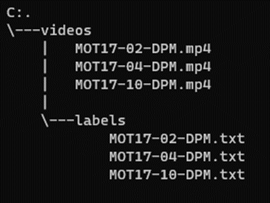

# 복잡한 환경에서 영상 기반의 다중물체 추적기술 보완 - DeepSORT를 활용한 pedestrian의 object permanence 개선  

<br>

## [Project Report](https://github.com/Marvin-Choi/YOLOv5_DeepSORT/blob/main/MOT_Project_Report_2024.04.02.pdf)

<br>

## **실행 설명서(Execution Manual)**  

<br>

### **실행 환경(Execution Environment)**

OS: Windows 10

Prompt: anaconda prompt

Python 3.8.18

Pytorch 1.7.1+cpu

Tesnorflow 2.4.1  

<br>

### **환경 설정(Setting Python Environment)**

같이 첨부된 소스코드를 원하는 디렉토리에 추가 후, python 3.8 가상환경 설정(anaconda 권장)

pytorch 1.7.1 버전을 자신의 OS와 환경에 맞게 설치 ([https://pytorch.org/get-started/previous-versions/](https://pytorch.org/get-started/previous-versions/))

ex)

```powershell
pip install torch==1.7.1+cpu torchvision==0.8.2+cpu torchaudio==0.7.2 -f https://download.pytorch.org/whl/torch_stable.html
```

이후 원하는 디렉토리에 추가한 소스코드 디렉토리로 들어가 requirements.txt로 남은 모듈 설치

```powershell
pip install -r requirements.txt
```  

<br>

### **Dataset: MOT17**

[https://motchallenge.net/data/MOT17/](https://motchallenge.net/data/MOT17/) 에서 dataset 다운로드 후 DPM dataset 사용

dataset 중 video, gt.txt 소스코드 디렉토리 내로 위치 변경

gt.txt 파일들을 각 video의 이름과 동일하게 변경 후, video 파일과 gt.txt 파일을 분리해서 경로 설정

  

<br>

### **코드 실행 방법(How to execute code)**

모든 MOT17 DPM video dataset에 대해 evaluation 진행

```powershell
python detect_track.py –weights yolov5m.pt –img 640 –source “MOT17 video 경로” –save-txt –class 0 –line-thickness 1
```

ex)

```powershell
python detect_track.py –weights yolov5m.pt –img 640 –source ./videos/MOT17-02-DPM.mp4 –save-txt –class 0 –line-thickness 1
```

- **-weights**: The name of the weight is passed here which will be automatically downloaded. We will use the medium network that is YOLOv5m.
- **-img**: Specifies image size, default size is 640
- **-source**: Specifies the path to the image or the video file, directory, webcam or link.
- **-classes**: Specifies indexes of classes. For example 0 for the person, 32 for sports ball. Refer to yolov5/data/coco.yaml for more classes.
- **-line-thickness**: Specifies bounding box thickness.  

<br>

```powershell
python ./mot_evaluation/evaluate_tracking.py --seqmap “MOT17 evaluation을 모두 완료한 video나 gt.txt 경로” --track ./runs/ --gt “MOT17 gt.txt 경로”
```

ex)

```powershell
python ./mot_evaluation/evaluate_tracking.py --seqmap ./MOT17/videos/labels --track ./runs/ --gt ./MOT17/videos/labels
```

- **-seqmap**: Here, video filenames whose evaluation is to be done are specified.
- **-track**: Specifies the path to the tracking result folders.
- **-gt**: Specifies ground truth file path.
